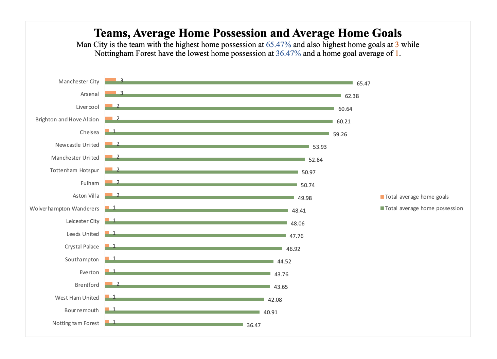

# Analysis-of-the-English-Premier-Season-2022-2023
Analyzing the English Premier League Season 2022/2023 

## Introduction
The dataset contains information about the full statistics from the English Premier League the top Professional football league in England and the biggest football league in Europe for the 2022/2023 season. This includes a comprehensive dataset and accompanying analysis of statistics in England. The dataset includes valuable information and data about Possession and Goal Scoring, the Effect of Home Advantage on Performance, Offensive Efficiency Analysis, Analysis of Fouls and Discipline, Comparing Passing Accuracy and Chances Created, Exploring Shots and On-Target Shots, Comparison of Possession and Passing Statistics. I used Excel for Data Analysis and Visualization.

## Problem Statement
I was trying to answer and find some answers concerning the English Premier League season and if there is a correlation between the statistics and outcomes that were produced during the season. The correlations I am trying to discover can be seen below:
1.	Comparing Possession and Goal Scoring: Is there a correlation between possession percentages and the number of goals scored by the home team? Is possession a significant factor in determining the outcome of the match?
2.	Offensive Efficiency Analysis: Can we determine which team had a higher efficiency in terms of shots on target? Are there any patterns in teams' ability to convert shots into goals?
3.	Comparing Passing Accuracy and Chances Created: How did the number of completed passes relate to the number of chances created?
4.	Comparison of Shots and Shots on Target Statistics: Percentage of shots on target to shots taken?
5.	Exploring fan attendance: Who accounted for the highest percentage of fans that attended games for the 2022/2023 season?

## Skills Demonstrated
1. Data  Processing
2. Data Cleaning
3. Data Analysis
4. Use of the Sum() function
5. Use of the AverageIFS() function
6. Use of the SUMIFS() function
7. Use of Pivot Table
8. Data Visualization

## Data Analysis
The original data provided was incomplete and can be seen under the file section. The file is called **Premier_League.csv**. Some key information like stadium name, and attendance record so I had to get the information to fill and replace the empty cells. The cleaned and updated table can be seen under the file section with the name **modified_Premier_League_stats.csv**. To fully answer the problem statement and find some correlations between things and events, I had to make use of the SUMIFS() function, SUM() function and the AVERAGEIFS() function. These functions were used to better simplify and understand the original data. The new and better data was used to create my pivot table and can be seen in the file section by the file name **remodeled_Premier_League_stats.csv**.
Pivot tables were used to answer the problem statements.

For problem 1, Is possession a significant factor in determining the outcome of the match?

For problem 2, Offensive Efficiency Analysis: Are there any patterns in teams' ability to convert shots into goals?

For problem 3, How did the number of completed passes relate to the number of chances created?

For problem 4, Percentage of shots on target to shots taken?

For problem 5, Who accounted for the highest percentage of fans that attended games for the 2022/2023 season?

The next step I did was to visualize my data solved using the Pivot table seen above. In the visuals below, better insights are made to better explain and provide solutions to the problem statement. A report was made also to better explain and state our findings.

For problem 1, Manchester City has the highest average home possession at 65.47%, indicating strong ball control during their home games. They also score an average of 3 goals per home match. Teams like Arsenal, Liverpool, Brighton and Hove Albion have relatively high average possession percentages and score 2 to 3 goals on average in their home matches. On the other hand, Nottingham Forest has the lowest average possession and scores 1 goal on average in their home matches. Some teams like Chelsea, Newcastle United, and Manchester United have mid-range possession percentages and score 1 to 2 goals on average at home.

For problem 2, Do Teams with higher percentages indicate better efficiency in converting their chances into goals?
Top Performers: Teams like Manchester City, Arsenal, and Liverpool have higher goal conversion rates, which suggests they were more clinical in scoring goals from their shots on target.

For problem 3, It appears that there is a positive correlation between the number of total team passes and the number of total team chances. This means that teams with higher total passes tend to create more scoring opportunities.

For problem 4, West Ham United, Wolverhampton Wanderers, and Crystal Palace have lower percentages of shots on target (30.59%, 30.58%, and 31.92% respectively), suggesting that they may need to improve their shooting accuracy.

For problem 5, Manchester United had the highest number of fans attending their matches. They accounted for 9% of the total fans that attended games for the season 2022/2023. This could mean that they have the most loyal fans, the biggest stadium, biggest fanbase in the country.

For better understanding, greater insights and explanations, the report below can show how the problem statements are answered.

## Conclusion

